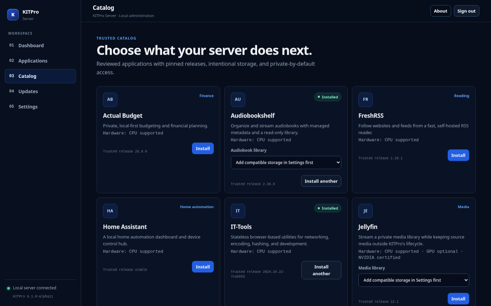

# KITPro Server — Public Alpha

KITPro is a technology company being developed alongside the KeepItTechie brand. Its mission is to make digital ownership, Linux, self-hosting, privacy, and personal infrastructure practical for ordinary users.

This repository contains the KITPro Server public alpha alongside
its product, architecture, security, and validation records.

KITPro manages trusted self-hosted applications on a local Linux server while
keeping Docker authority behind a constrained, AppArmor-confined helper.

Start with the [public alpha quickstart](docs/release/quickstart.md). The
current catalog and platform boundary are in the [application catalog](docs/application-catalog.md)
and [support matrix](docs/support-matrix.md).

KITPro is licensed under the [Apache License 2.0](LICENSE).
Learn more about [KITPro Server](https://os.kitpro.us/server).

## KITPro Server

KITPro Server provides a local web interface for deploying, operating, monitoring, updating, backing up, and troubleshooting self-hosted applications.

The target user has purchased or repurposed a Linux server or mini PC and wants to self-host services without first becoming an expert in containers, networking, reverse proxies, storage, backups, or Linux administration.

KITPro Server will simplify standard infrastructure. It will not replace that infrastructure with proprietary formats or require a KITPro cloud service for core server functions.

The public alpha lets a user:

1. Install KITPro Server on a supported Linux host.
2. Open its local dashboard.
3. View detected host information.
4. Deploy a supported application, including Paperless-ngx's managed components.
5. Register approved media or file storage and attach it read-only or as an exclusive read-write location where the trusted app requires it.
6. View the application's runtime health.
7. Start and stop the application.
8. Update the application safely.
9. View relevant logs.
10. Uninstall the application without automatically destroying persistent or imported user data.

## Repository areas

| Path | Purpose | Current status |
| --- | --- | --- |
| [`software/`](software/README.md) | KITPro Server and later software products | Phase 1 alpha implementation |
| [`os/`](os/README.md) | A possible future KITPro operating system or platform | Not in Phase 1 |
| [`hardware/`](hardware/README.md) | Possible future KITPro hardware | Not in Phase 1 |
| [`cloud/`](cloud/README.md) | Optional future cloud and support services | Not in Phase 1 |

Architecture experiments and development-only host tooling live under [`prototypes/`](prototypes/privilege-boundary/README.md) and [`tools/`](tools/README.md). They are not production KITPro Server code.

## Project documents

- [`docs/vision.md`](docs/vision.md) defines the problem, audience, and intended outcome.
- [`docs/principles.md`](docs/principles.md) records the non-negotiable product principles.
- [`docs/architecture.md`](docs/architecture.md) explains the implemented system constraints and lifecycle.
- [`docs/application-catalog.md`](docs/application-catalog.md) lists the supported applications, pinned releases, and catalog limitations.
- [`docs/hardware-acceleration.md`](docs/hardware-acceleration.md) explains CPU fallback, Ollama, and accelerator troubleshooting.
- [`docs/trusted-storage.md`](docs/trusted-storage.md) explains approved external storage and Jellyfin media setup.
- [`docs/media-data-apps.md`](docs/media-data-apps.md) shows how to install Navidrome, Audiobookshelf, and SFTPGo safely.
- [`docs/architecture/gpu-device-access.md`](docs/architecture/gpu-device-access.md) defines typed device classes and helper enforcement.
- [`docs/application-manifest.md`](docs/application-manifest.md) covers hardware, external storage, and schema v5 runtime identities.
- [`docs/roadmap.md`](docs/roadmap.md) divides Phase 1 into small, gated milestones.
- [`docs/api-reference.md`](docs/api-reference.md) describes the supported authenticated API surface.
- [`docs/release/known-limitations.md`](docs/release/known-limitations.md) records honest alpha constraints.
- [`docs/decisions/`](docs/decisions/README.md) contains architecture decision records.
- [`docs/security/threat-model.md`](docs/security/threat-model.md) defines actors, assets, boundaries, and concrete attack paths.
- [`docs/security/invariants.md`](docs/security/invariants.md) lists the security rules that future implementation must preserve.
- [`docs/support-matrix.md`](docs/support-matrix.md) lists certified platforms and their boundaries.
- [`docs/release/quickstart.md`](docs/release/quickstart.md) is the shortest path from package install to a running app.

## Phase 1 boundaries

Phase 1 does not include custom hardware, manufacturing, KITPro OS, mandatory KITPro accounts, a hosted SaaS control plane, a proprietary container runtime, vendor lock-in, a large application catalog, or AI features that the core workflow does not need.

Technology choices remain open until the project records their requirements, alternatives, security effects, and operational costs in architecture decision records.
