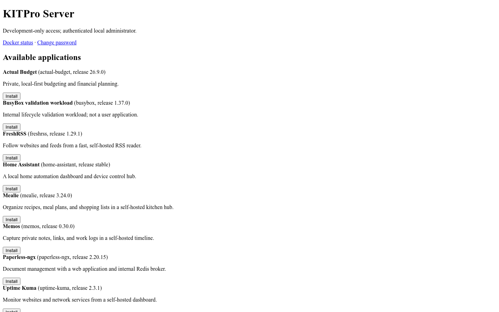
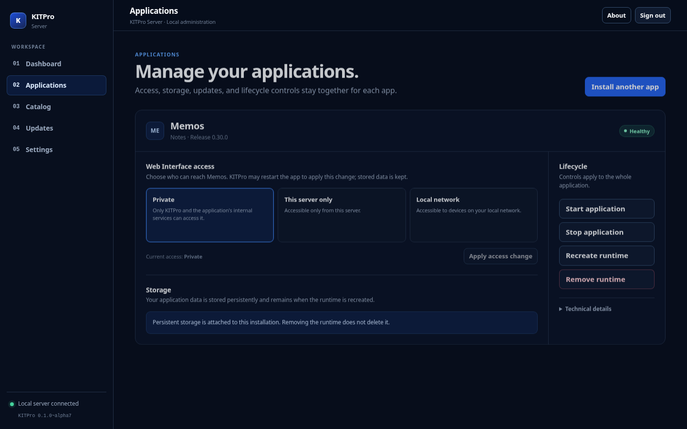

# KITPro Server production slice

[View the KITPro Server product page](https://os.kitpro.us/server).





KITPro Server is licensed under the [Apache License 2.0](../../LICENSE).

This is a deliberately bounded production implementation. It provides a local API, host/Docker inspection, a typed helper boundary, a local-administrator authentication boundary, and a constrained embedded application catalog. The catalog contains fourteen single-container applications plus Paperless-ngx as a managed multi-container application. The helper never accepts arbitrary Docker or shell commands.

Catalog applications are represented by schema-versioned JSON
catalog manifest resolved into a typed application plan. Manifests are not
Compose files and cannot provide host paths, Docker IDs, credentials,
privileges, or arbitrary Docker configuration; the helper independently
revalidates each plan before Docker execution.

An installation ID owns persistent application data and remains stable across
runtime removal and recreation. Disposable container/network names include a
separate runtime generation. `POST /api/v1/installations/{id}/recreate`
explicitly recreates a removed runtime; catalog install always creates a new
installation. Runtime removal never deletes application data.

Authentication is a single local-administrator setup/login boundary. The
control plane remains loopback-only by package default; controlled application
service exposure does not expose the KITPro dashboard itself.

The Phase 1 authentication boundary uses bcrypt cost 10 and rejects passwords
whose UTF-8 encoding exceeds bcrypt's 72-byte input limit (inputs are never
truncated). Sessions are durable in the control database with a 30-minute idle
timeout and 12-hour absolute lifetime. Login failures use bounded,
server-side exponential throttling keyed by the network peer and normalized
username; state expires and successful login clears it. `KITPRO_AUTH_IDLE` and
`KITPRO_AUTH_ABSOLUTE` may shorten durations for disposable integration tests,
but production defaults must remain in force. `KITPRO_SECURE_COOKIES=1` is
required for HTTPS deployment and adds the Secure cookie attribute.

Local recovery is host-local only: an administrator with root/sudo access may
stop the API, use a future recovery utility or controlled database procedure
to replace the administrator credential, and restart it. Recovery is never
available through an unauthenticated web request and must revoke all existing
sessions; operators should avoid placing passwords in shell history.

Build with Go 1.27 and `CGO_ENABLED=0`:

```sh
go build -trimpath -buildvcs=false -ldflags='-s -w' ./cmd/kitpro-api ./cmd/kitpro-helper
```

The supported Debian 13 and Ubuntu Server 26.04 LTS amd64 package is built with
`./packaging/build-package.sh 0.1.0~alpha1`. See the [package installation
guide](../../docs/install-debian-package.md) and [upgrade/removal
guide](../../docs/upgrade-uninstall-debian-package.md). Fully updated Arch
Linux amd64 hosts using official repositories and `linux-lts` use the native
package built by `./packaging/build-arch-package.sh 0.1.0_alpha1`; its rolling
release policy is documented in the [Arch install guide](../../docs/install-arch-package.md).
The trusted application inventory is documented in the [catalog guide](../../docs/application-catalog.md).
Rocky Linux 10 remains experimental.
